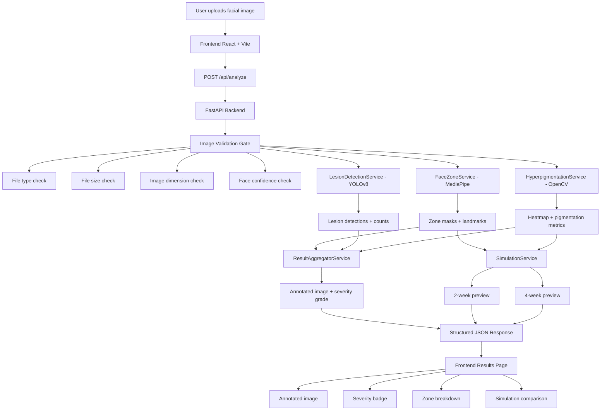
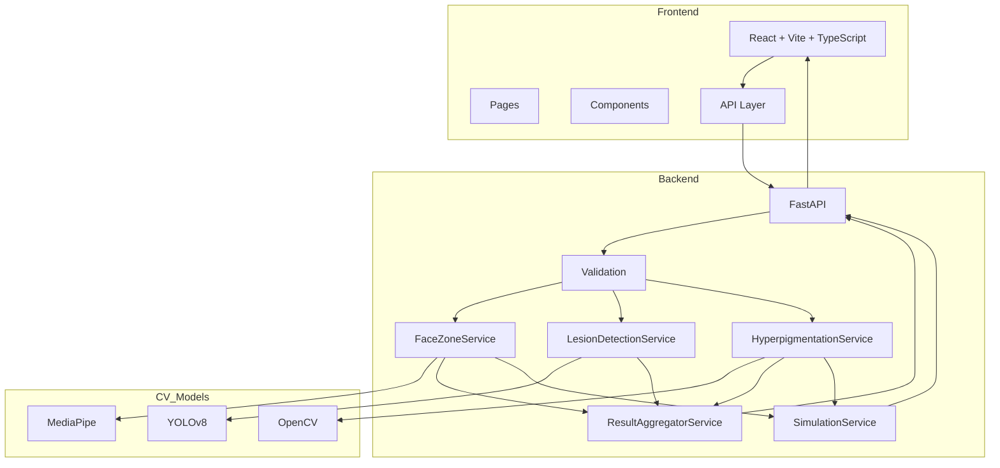

# 🧠 DermaVision AI  
### Skin Health Assessment & Progress Simulation Platform  

<p align="center">
  
  
  
  
  
</p>

---

## 🚀 Overview

**DermaVision AI** is a computer vision-powered web application that analyzes facial skin from a single image and generates:

- 🧬 Lesion detection (acne, spots)
- 🎯 Zone-based facial analysis
- 🌡️ Hyperpigmentation heatmaps
- 📊 Clinical severity grading (IGA scale)
- ✨ Simulated progress preview (2-week & 4-week)

> ⚡ Built for hackathon MVP → scalable to production SaaS

---

## 🧠 Problem Statement

Skin health analysis today:
- ❌ Requires dermatologist visits (₹500–₹2000)
- ❌ Not accessible in Tier-2/3 cities
- ❌ No continuous tracking between visits

### 💡 Our Solution

A **smartphone-based AI tool** that provides:
- Instant skin report  
- Visual progress simulation  
- Objective tracking  

---

## 🏗️ Tech Stack

### 🖥️ Frontend
- ⚛️ React 18
- ⚡ Vite
- 🎨 TailwindCSS
- 🔗 Axios
- 🧭 React Router

### ⚙️ Backend
- 🚀 FastAPI (Python 3.11)
- 📦 Pydantic
- 🔒 Rate limiting (SlowAPI)

### 🧪 Computer Vision
- 🧠 MediaPipe → Face Mesh (468 landmarks)
- 🎯 YOLOv8 → Lesion Detection
- 🖼️ OpenCV → Image Processing & Simulation

---

## 🏗️ System Architecture



---

## 🔥 Key Features

### 📸 Image Upload & Validation
- JPEG/PNG only
- Face detection confidence check
- Rejects invalid images

### 🧠 Face Zone Segmentation
- Forehead
- Left Cheek
- Right Cheek
- Nose
- Chin

### 🎯 Lesion Detection
- YOLOv8-based bounding boxes
- Per-zone lesion count
- Total lesion score

### 🌡️ Hyperpigmentation Analysis
- LAB color space
- Adaptive thresholding
- Heatmap overlay

### 📊 Severity Grading (IGA Scale)
| Lesions | Grade |
|--------|------|
| 0 | Clear |
| 1–5 | Mild |
| 6–20 | Moderate |
| 21+ | Severe |

### ✨ Simulation Engine
- 2-week improvement preview
- 4-week improvement preview
- Bilateral filtering + tone correction

---

## ⚙️ Component Architecture


## 📂 Project Structure

```text
dermavision-ai/
├── backend/
│   ├── app/
│   │   ├── api/
│   │   ├── core/
│   │   ├── services/
│   │   ├── models/
│   │   └── utils/
│   └── requirements.txt
├── frontend/
│   ├── src/
│   │   ├── api/
│   │   ├── components/
│   │   ├── hooks/
│   │   ├── pages/
│   │   └── types/
│   └── package.json
└── README.md
```

### 1. Setup / Installation
Very important. People should know how to run it.

```md
## ⚙️ Setup Instructions
```

### Backend
```bash
cd backend
python -m venv venv
venv\Scripts\activate
pip install -r requirements.txt
uvicorn app.main:app --reload --port 8000
```
### Frontend
```bash
cd frontend
npm install
npm run dev
```
